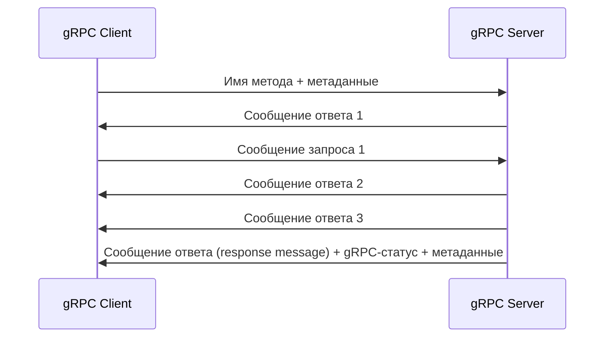

---
aliases:
 - двунаправленный поток
 - двунаправленного потока
 - двунаправленному потоку
 - двунаправленным потоком
 - двунаправленном потоке
 - двунаправленные потоки
 - двунаправленных потоков
 - двунаправленнным потокам
 - двунаправленными потоками
 - двунаправленных потоках
share: true
tags: 
 - gRPC/duplex-streaming
---
# Двунаправленный поток
Каждый из участников взаимодействия отправляет свои сообщения в потоковом режиме, это может происходить параллельно, что означает, что порядок, в котором отправляются сообщения от клиента и от сервера, отсутствует. Клиент инициирует удалённый вызов процедуры с помощью указания имени метода и метаданных. Затем сервер может немедленно ответить возвратом статуса и метаданных (или же может это сделать, когда клиент отправит все свои сообщения).
## Диаграмма

## Protobuf
```protobuf
rpc DuplexStreamingFunction (stream InputMessage) returns (stream OutputMessage) {}
```
## Реализация на сервере
Приведём пример, в котором *сперва* читаются все сообщения клиентского потока, *а затем* отправляются сообщения серверного потока. Однако, легко придумать пример, когда сообщения потока отправляются асинхронно или в ответ н какое-либо сообщение с клиента.
```csharp
public override async Task DuplexStreamingFunction(
	IAsyncStreamReader<InputMessage> requestStream,
	IServerStreamWriter<OutputMessage> responseStream,
	ServerCallContext context)
{
	// итерируемся по клиентским сообщениям
	await foreach (var createRequest in requestStream.ReadAllAsync())
	{
		// реализация обработки
	}
	// итерируемся по IEnumerable<OutputMessage> или IAsyncEnumerable<OutputMessage>
	foreach (var outputMessage in outputMessageEnumerable)
	{
		await responseStream.WriteAsync(outputMessage);
	}
}
```
## Использование на клиенте
Также приведём пример, в котором *сперва* отправляем все клиентские сообщения, *а затем* получаем все серверные сообщения.
```csharp
using var duplexStreamingCall = client.DuplexStreamingFunction();
// итерируемся по IEnumerable<InputMessage> или IAsyncEnumerable<InputMessage>
foreach (var inputMessage in inputMessageEnumerable)
{
	await duplexStreamingCall.RequestStream.WriteAsync(request);
}
// Сообщаем серверу о завершении передачи
await duplexStreamingCall.RequestStream.CompleteAsync();
// Читаем поток с сервера
await foreach (var OutputMessage in duplexStreamingCall.ResponseStream.ReadAllAsync())
{
	// обработка переданных сообщений
}
```
## Ссылки
[[ch-3-types-of-grpc-services|Диаграммы всех видов взаимодействия]]
[[ch-5-create-and-compile-protobuf-files|примеры Protobuf]]
[[ch-5-write-configure-and-expose-grpc-services|Примеры реализаций на сервере]]
[[ch-7-duplex-streaming-call|Пример клиента]]
