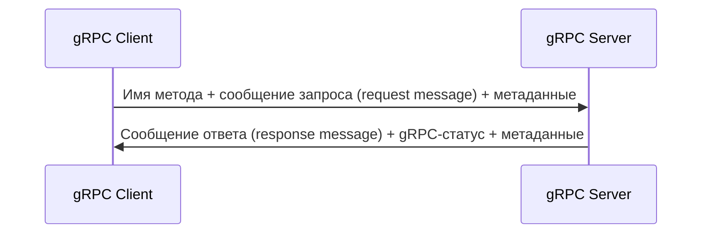

---
aliases:
 - унарный вызов
 - унарного вызова
 - унарному вызову
 - унарным вызовом
 - унарном вызове
 - унарным вызовом
 - унарные вызовы
 - унарных вызовов
 - унарным вызовам
 - унарных вызовах
 - унарными вызовами
 - унарная функция
 - унарной функции
 - унарной функцией
share: true
tags:
 - gRPC/unary
---
# Унарный вызов
Клиент инициирует удалённый вызов процедуры с помощью указания имени метода, метаданных и сообщения запроса. Сервер возвращает ответ, содержащий gRPC-статус, сообщение ответа и метаданные. 
## Диаграмма

## Protobuf
```protobuf
rpc UnaryFunction (InputMessage) returns (OutputMessage) {}
```
## Реализация на сервере
```csharp
public override async Task<OutputMessage> UnaryFunction(InputMessage request, ServerCallContext context)
{
	var result = new OutputMessage(); // реализация получения ответа
	return result;
}
```
## Использование на клиенте
Простейший асинхронный вариант (возможен и синхронный вариант `UnaryFunction()`)
```csharp
OutputMessage result = await client.UnaryFunctionAsync(new InputMessage {/* заполняем поля*/});
```
Другой вариант, если нужно прочитать метаданные:
```csharp
var сallObj = client.UnaryFunctionAsync(new InputMessage {/* заполняем поля*/});
OutputMessage result = await сallObj.ResponseAsync;
//после этого доступны метаданные
```
## Ссылки
[[ch-3-types-of-grpc-services|Диаграммы всех видов взаимодействия]]
[[ch-5-create-and-compile-protobuf-files|примеры Protobuf]]
[[ch-5-write-configure-and-expose-grpc-services|Примеры реализаций на сервере]]
[[ch-7-unary-call|Пример клиента]]
