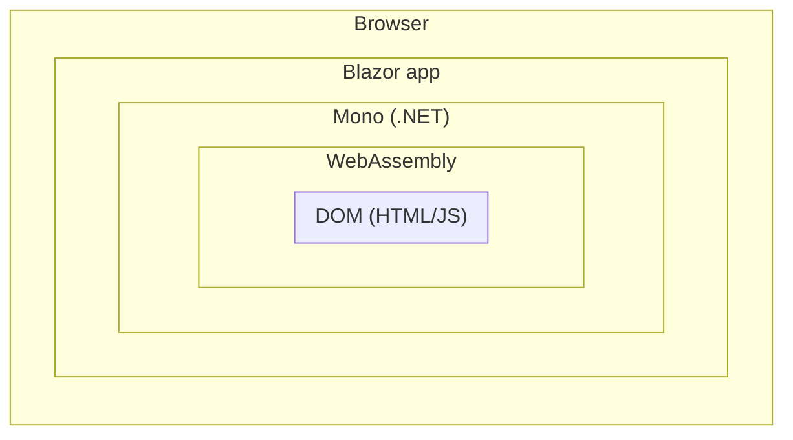
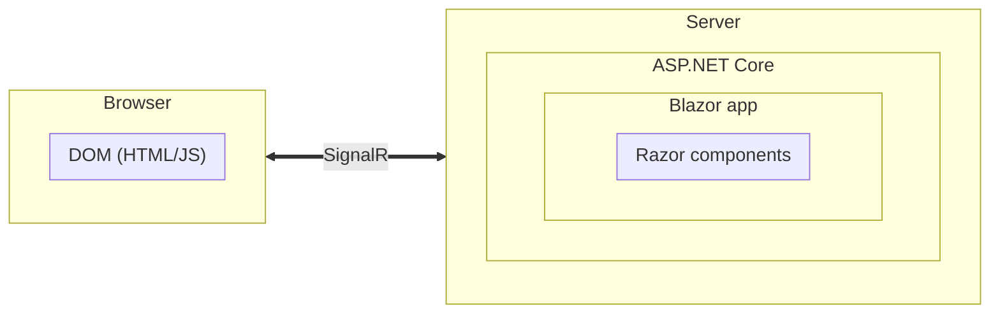

# ASP.NET Core Blazor
ASP.NET Core Blazor (или просто Blazor) - это последний на сегодняшний день фреймворк для разработки веб-страниц при помощи C\#, HTML и синтаксиса Razor. Идея состоит в том, что приложение выполняется не на стороне сервера, а на стороне клиента. Это становится возможным засчёт использования технологии *WASM (WebAssembly)*.
Blazor — фреймворк, позволяющий собирать компоненты и веб-страницы на основе WebAssembly. Иными словами, Blazor — фреймворк для одностраничных приложений, выполняемый при помощи .NET (Mono) в браузере.
Вот так выглядит стек Blazor в браузере.

Также Blazor поддерживает модель серверного хостинга. В этом случае приложение выполняется на сервере внутри приложения ASP.NET Core, а взаимодействия клиента с сервером происходят с использованием SignalR.

Сравнение разных моделей хостинга:
- **Blazor WebAssembly hosting model**
	- Преимущества
		- Нет зависимости от .NET на сервере.
		- Код выполняется на клиенте.
		- Может подключаться к базам данным напрямую.
		- Может безопасно хранить секреты и строки подлючения.
		- Имеет доступ к API Windows и .NET Framework.
		- Не нужен веб-сервер ASP.NET Core.
	- Недостатки
		- Требуется поддержка WebAssembly в браузере.
		- Перед началом работы требуется скачать всё приложение, что задерживает старт.
- **Blazor Server hosting model**
	- Преимущества
		- Более быстрая загрузка; нет необходимости загружать приложение целиком.
		- Полностью использует серверные возможности, как обычное приложение ASP.NET Core.
		- Работает в любом браузере.
	- Недостатки
		- Большой объем взаимодействия с сервером может замедлить выполнение.
		- Если соединение с клиентом рвётся, приложение перестаёт выполняться.
		- Требуется обрабатывать клиентское состояние, как и в обычном приложении ASP.NET Core.
		- Для работы требуется сервер ASP.NET Core.

Для разработчиков мобильных приложений существует поддержка *PWA (Progressive Web Application)*. PWA — это вебсайт, который выглядит и ведёт себя как мобильное приложение.

В этой книге мы будем строить приложение при помощи Blazor WebAssembly и gRPC-Web, так что серверный Blazor упоминаться больше не будет.