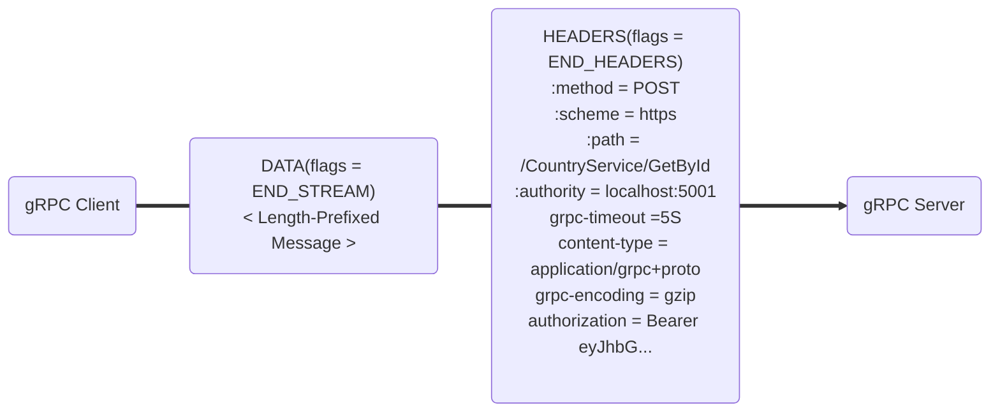
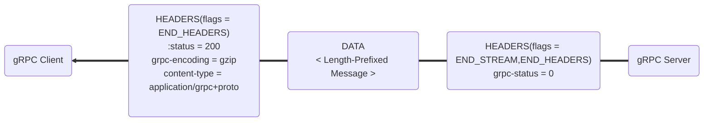

# Запросы и ответы gRPC на основе HTTP/2
Давайте рассмотрим, как gRPC работает через фреймы [[http-2|HTTP/2]].
Мы уже знаем, что gRPC работает следующим образом:
- использует классические заголовки запроса HTTP;
- использует специальные заголовки, называемыет [[ch-3-trailers|трейлерами]];
- ответ содержит указанный в трейлерах gRPC-статус, информирующий клиента о результатах запроса;
- ответ закодирован (encoded) в бинарном виде.

Однако, gRPC также отправляет на сервер HTTP-запрос следующим образом:
- используется TLS (другими словами, HTTPS). Также он может работать без HTTPS, но это НЕ рекомендуется;
- используется исключительно POST;
- тип содержимого (Content-Type) будет либо `"application/grpc"`, либо `"application/grpc+proto"`, либо `"application/grpc+json"`;
- используется заголовок `Authority` с доменным именем сервера;
- используется заголовок `Path` с RPC URI;
- статус HTTP всегда `200 OK` с момента начала обработки запроса сервером. Однако, если сервер не может обработать запрос в силу недоступности, может вернуться статус `503 Unavailable`.

Полное описание того, как gRPC работает поверх фреймов HTTP/2 [здесь](https://github.com/grpc/grpc/blob/master/doc/PROTOCOL-HTTP2.md)
Рассмотрим, как наш запрос к сервису *CountryService* выполняется в терминах фреймов HTTP/2. *CountryService* расположен по адресу `localhost:5001`, используется *Дедлайн* размером в 5 секунд, и используется токен JWT. Включено сжатие gzip. Запрос завершается успешно.
В запросе, во фрейме `DATA` стоит флаг `END_STREAM` (*EOS, end of stream*), означающий, что больше данных не предполагается. В случае потока, этот флаг будет стоять в последнем сообщении потока. Во фрейме `HEADERS` флаг `END_HEADERS` (*EOH, end of headers*) означает, что переданы все заголовки.
**gRPC Request**

В ответе сперва, во фрейме `HEADERS` передаются заголовки с флагом EOH, потом фрейм `DATA`, потом снова фрейм `HEADERS` с трейлерами, в котором указано, что более данных и заголовков не будет, а также со статусом.
**gRPC Response**
