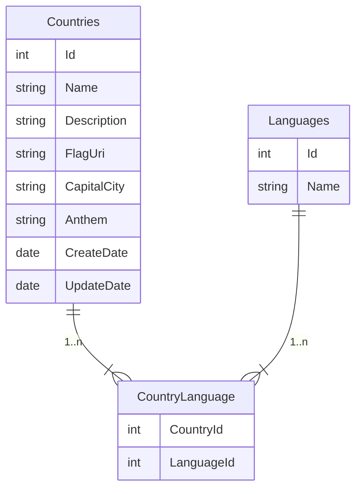

# Настраиваем SQL Server и используем EF Core для доступа к данным

Для хранения данных нашего приложения будем использовать MS SQL Server. Специальная локальная версия поставляется вместе с Visual Studio.
Для удобства можно также установить MS SQL Server Management Studio, [ссылка на закачку есть на этой странице](https://learn.microsoft.com/en-us/sql/ssms/download-sql-server-management-studio-ssms?view=sql-server-ver16). После установки можно подключиться к локальному серверу, используя следующее имя сервера:
```
(LocalDB)\MSSQLLocalDB
```
## Используем Entity Framework Core для доступа к данным.
EF Core позволяет:
- Спроектировать БД при помощи кода;
- Заполнить первоначальными данными при помощи кода;
- Делать запросы к БД при помощи LINQ.

### Проектируем БД при помощи кода
Наша БД будет состоять из следующих таблиц и отношений

- `Countries` — таблица с данными о странах, в том числе именем, описанием, названием столицы и гимна, а также URI картинки с изображением флага. Также записываем дату создания записи и дату изменения;
- `Languages` — справочник языков;
- `CountryLanguage` — таблица для хранения данных о том, на каких языках говорят в стране. Реализует отношение *многие-ко-многим*.

Опишем эти таблицы на языке C#, чтобы потом использовать их для генерации БД и, затем, запросов к БД. Вот, что у нас получится (можно разнести классы по отдельным файлам, тут для простоты запишем подряд)
```csharp
namespace CountryService.DAL.Database.Entities;

public class Country
{
    public int Id { get; set; }
    public string Name { get; set; }
    public string Description { get; set; }
    public string FlagUri { get; set; }
    public string CapitalCity { get; set; }
    public string Anthem { get; set; }
    public DateTime CreateDate { get; set; }
    public DateTime? UpdateDate { get; set; }
    public ICollection<Language> Languages { get; set; }
    public IEnumerable<CountryLanguage> CountryLanguages { get; set; }
}
public class Language
{
    public int Id { get; set; }
    public string Name { get; set; }
    public ICollection<Country> Countries { get; set; }
    public IEnumerable<CountryLanguage> CountryLanguages { get; set; }
}
public class CountryLanguage
{
    public int CountryId { get; set; }
    public int LanguageId { get; set; }
}
```

Чтобы воспользоваться всеми возможностями EF Core, нужно добавить в проект `CountryService.DAL` три NuGet-пакета:
- Microsoft.EntityFrameworkCore.SqlServer;
- Microsoft.EntityFrameworkCore.Tools;
- Microsoft.EntityFrameworkCore.Design.

После того, как мы установили эти пакеты, нам нужно определить класс контекста (database context class), который описывает сущности C# как сущности базы данных, а также описывает модель SQL, которую требуется сгенерировать из этих сущностей.
Создадим класс контекста `CountryContext`, унаследованный от `DbContext`, базового класса EF. Также внесем некоторые изменения в метод `OnModelCreating` для поддержки связи *многие-ко-многим*[^1]

[^1]: [подробнее](https://learn.microsoft.com/en-us/ef/core/modeling/relationships/many-to-many#many-to-many-with-class-for-join-entity)

> [!Note]
> Будем размещать юзинги в специальном файле **GlobalUsings.cs**. В каждом проекте будет такой файл.

```csharp
namespace CountryService.DAL.Database;

public class CountryContext : DbContext
{
    public CountryContext() : base() { }
    public CountryContext(DbContextOptions<CountryContext> options) : base(options)
    {
    }

    protected override void OnConfiguring(DbContextOptionsBuilder optionsBuilder)
    {
        optionsBuilder.UseSqlServer(@"Data Source=(LocalDB)\MSSQLLocalDB;Initial Catalog=CountryService;");
    }

    public DbSet<Country> Countries { get; set; }
    public DbSet<Language> Languages { get; set; }

    protected override void OnModelCreating(ModelBuilder modelBuilder)
    {
        modelBuilder.Entity<Country>()
            .HasMany(e => e.Languages)
            .WithMany(e => e.Countries)
            .UsingEntity<CountryLanguage>(
                l => l.HasOne<Language>()
                    .WithMany(lng =>lng.CountryLanguages)
                    .HasForeignKey(e => e.LanguageId),
                r => r.HasOne<Country>()
                    .WithMany(c => c.CountryLanguages)
                    .HasForeignKey(e => e.CountryId)
            );
}
```
Здесь мы добавили (в методе `OnConfiguring`) строку подключения прямо в код (для простоты), однако в реальных приложениях нужно использовать строку состояния из настроек.
Теперь откроем окно **Package Manager Console** в VS, выберем проект CountryService.DAL, и введём команду 
```powershell
Add-Migration Initial
```
Если всё пройдёт хорошо, в проекте появится папка **Migrations** с файлами, необходимыми для создания БД (то есть, первой миграции).
Далее в том же окне выполним команду `Update-Database`. При этом применится только что созданная нами миграция.
Можно убедиться в том, что нужные таблицы (со всеми нужными ключами) были созданы:
![[Pasted image 20230506194629.png]]

### Наполняем базу первоначальными данными
Наша база данных будет заполняться из файла, который будет содержать все сведения о странах. Однако, в этом файле не будет названий языков, только их Id. Следовательно, нам нужно заполнить таблицу языков записями, чтобы мы могли сопоставить названия языков с их Id. Для этого нам нужно добавить в метод `OnModelCreating()` нашего контекста следующее:
```csharp
modelBuilder.Entity<Language>()
	.HasData(
		new Language {Id = 1, Name = "English"},
		new Language {Id = 2, Name = "French"},
		new Language {Id = 3, Name = "Spanish"});
```
Теперь нам надо создать новую миграцию, так как мы внесли изменения в процесс создания БД. Назовём её `SeedInitialData`. Откроем **Package Manager Console** и введём
```powershell
Add-Migration SeedInitialData
```
Далее снова команда `Update-Database`
### Делаем запросы к БД с помощью LINQ
Мы создали нашу базу данных, наполнили её справочной информацией. Теперь нам нужно делать к ней запросы, используя LINQ, для выполнения операций CRUD, а именно:
- создать запись о стране;
- изменить запись о стране;
- удалить запись о стране;
- получить запись о стране;
- получить запись обо всех странах.

Создадим в проекте `CountryService.DAL` папку **Repositories**, в которой создадим класс `CountryRepository`. Этот класс будет реализацией интерфейса `ICountryRepository`, который мы создадим в проекте `CountryService.Domain` — это будет *контракт* репозитория.   Также создадим классы доменной модели, которые будут использоваться в нашем контракте. Ещё их называют *DTO (data transfert object)*. Так, в нашем приложении будет всего один DTO, содержащий всю необходимую информацию о стране.
```csharp
public record CountryModel
{
    public int Id { get; init; }
    public string Name { get; init; }
    public string Description { get; init; }
    public string FlagUri { get; init; }
    public string CapitalString { get; init; }
    public string Anthem { get; init; }
    public IEnumerable<string> Languages { get; init; }
}
```
Далее нам потребуется определить ещё две модели — `CreateCountryModel`
```csharp
public record CreateCountryModel
{
    public string Name { get; set; }
    public string Description { get; set; }
    public string FlagUri { get; set; }
    public string CapitalCity { get; set; }
    public string Anthem { get; set; }
    public DateTime CreateDate { get; set; }
    public IEnumerable<int> Languages { get; set; }
}
```
и `UpdateCountryModel`
```csharp
public record UpdateCountryModel
{
    public int Id { get; set; }
    public string Description { get; set; }
    public DateTime UpdateDate { get; set; }
}
```
Теперь создадим в `CountryService.Domain` папку **Repositories** и создадим в ней наш *контракт* репозитория
```csharp
public interface ICountryRepository
{
    Task<int> CreateAsync(CreateCountryModel countryToCreate);
    Task<int> UpdateAsync(UpdateCountryModel countryToUpdate);
    Task<int> DeleteAsync(int id);
    Task<CountryModel?> GetAsync(int id);
    Task<List<CountryModel>> GetAllAsync();
}
```
Теперь добавим реализацию репозитория в проекте `CountryService.DAL`.
```csharp
public class CountryRepository : ICountryRepository
{
    private readonly CountryContext _countryContext;

    public CountryRepository(CountryContext countryContext)
    {
        _countryContext = countryContext;
    }
    public async Task<int> CreateAsync(CreateCountryModel countryToCreate)
    {
        var country = new Country
        {
            Name = countryToCreate.Name,
            Description = countryToCreate.Description,
            CapitalCity = countryToCreate.CapitalCity,
            Anthem = countryToCreate.Anthem,
            FlagUri = countryToCreate.FlagUri,
            CreateDate = countryToCreate.CreateDate,
            CountryLanguages = countryToCreate.Languages
	            .Select(l => new CountryLanguage {LanguageId = l}).ToList()
        };
        await _countryContext.Countries.AddAsync(country);
        await _countryContext.SaveChangesAsync();

        return country.Id;
    }

    public Task<int> UpdateAsync(UpdateCountryModel countryToUpdate)
    {
        var country = new Country
        {
            Id = countryToUpdate.Id,
            Description = countryToUpdate.Description,
            UpdateDate = countryToUpdate.UpdateDate
        };
        _countryContext.Entry(country).Property(p => p.Description).IsModified = true;
        _countryContext.Entry(country).Property(p => p.UpdateDate).IsModified = true;
        return _countryContext.SaveChangesAsync();
    }

    public Task<int> DeleteAsync(int id)
    {
        var country = new Country
        {
            Id = id
        };
        _countryContext.Entry(country).State = EntityState.Deleted;
        return _countryContext.SaveChangesAsync();
    }

    public Task<CountryModel?> GetAsync(int id) =>
        _countryContext.Countries.AsNoTracking().ToDomain().SingleOrDefaultAsync(c => c.Id == id);

    public Task<List<CountryModel>> GetAllAsync() =>
        _countryContext.Countries.AsNoTracking().ToDomain().ToListAsync();
}
```
Рассмотрим этот код. В `CreateAsync` мы создаём новый объект `Country`, заполняем его поля. Обратите внимание, что для связи с таблицей языков мы добавляем объекты `CountryLanguage`. Затем добавляем объект в контекст при помощи `AddAsync` и затем создаём новую запись в БД при помощи `SaveChangesAsync`. После вызова этого метода нам становится известен `Id`, который мы и возвращаем.
В `UpdateAsync` мы создаём объект `Country`, заполняем поля и *помечаем их* как изменённые. Далее сохраняем изменения в БД.
В `DeleteAsync` мы помечаем объект `Country` с переданным нам `Id` как удалённый и сохраняем изменения в БД.
В `GetAsync` и `GetAllAsync` мы запрашиваем либо один (по `Id`) либо все объекты, *маппируем* их на доменную модель и возвращаем. Мы использовали метод `AsNoTracking()` для того, чтобы отключить слежение за изменениями полученных объектов — это позволяет повысить производительность запроса[^2], а мы не планируем изменять их. Метод `ToDomain()` — это метод расширения, определяем его в отдельном классе. Вот он:
```csharp
public static class CountryLanguageMapper
{
    public static IQueryable<CountryModel> ToDomain(this IQueryable<Country> countries)
        => countries.Select(c => new CountryModel
        {
            Id = c.Id,
            Name = c.Name,
            Description = c.Description,
            CapitalCity = c.CapitalCity,
            Anthem = c.Anthem,
            FlagUri = c.FlagUri,
            Languages = c.Languages.Select(l => l.Name)
        });
}
```
Мы закончили со слоем доступа к данным, теперь переходим к следующим слоям.

[^2]: подробнее о слежении или *трекинге* можно прочесть [тут](https://learn.microsoft.com/en-us/ef/core/change-tracking/)