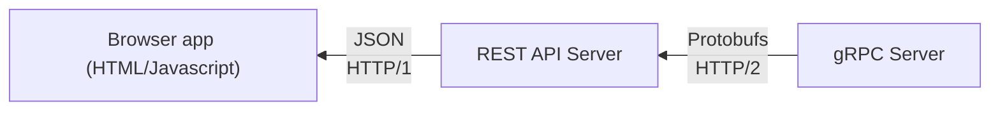
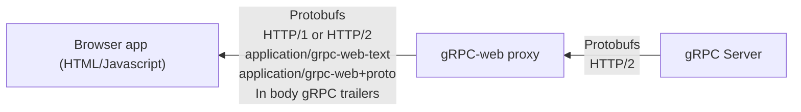

# История и обзор gRPC-web
## История gRPC-web
Как вы уже знаете, gRPC и Protobufs появились из проекта с открытым исходным кодом в начале 2000-х, полностью перейдя в open source в 2014 году. После этого Гугл озадачился вопросом “как можно использовать gRPC в браузере?”. Тем временем британская компания Improbable независимо искала решение этой же проблемы. Летом 2016 года обе компании объединили усилия, что привело к разработке спецификации gRPC-web.
С другой стороны, до 2016 года существовал способ использовать gRPC в браузере: использовать REST API для конвертации вызовов RPC в эндпоинты REST. Примерно так:

Понятно, что такое решение не было ни практичным, ни эффективным и, как следствие, не жизнеспособным в длительной перспективе. Разработка REST API в качестве промежуточного звена между gRPC и браузером вносила дополнительные проблемы:
- необходимо разработать дополнительное приложение, при этом необходимо проецировать статусы и [[ch-3-trailers|трейлеры]] gRPC на заголовки и статусы HTTP;
- появляется новая возможная точка отказа;
- система уязвима для проблем с сетью (ещё одна возможная точка отказа);
- необходимо поддерживать промежуточное приложение при развитии клиентской части (браузер) или серверной части (gRPC);
- теряется выигрыш в производительности, появляющийся при использовании [[http-2|HTTP/2]], а также появляется дополнительный оверхед при конвертации бинарных данных в JSON и обратно. Потоковая передача не поддерживается, за исключением передачи файлов, таких как звуковые или видеофайлы.

Частично эти проблемы решает gRPC-web.
## Обзор gRPC-web
Итак, Google и Improbable объединили усилия, определив общий стандарт gRPC-web, который поддерживал:
- [[grpc-unary-call|унарные вызовы]] и [[grpc-server-streaming-call|серверные потоки]];
- [[ch-3-trailers|трейлеры]], размещаемые в теле ответа;
- HTTP/2, ожидающий поддержки этого протокола браузерами;
- два значения заголовка `Content-type`:
	- `application/grpc-web+proto`, поддерживающий бинарную нагрузку (payload) и *только* унарные вызовы;
	- `application/grpc-web-text`, поддерживающий текстовую нагрузку (закодированную в Base64).

Принцип действия схож с использованием REST API. Всё также обязательный прокси конвертирует HTTP/2 в HTTP/1 и обратно, а также конвертирует бинарную нагрузку в текстовую в случае, когда используется `application/grpc-web-text`. Однако при этом исчезает потенциальная точка отказа, так как нет приложения написанного вами, требующего поддержки и подверженного регрессу[^1]. Примером такого прокси может быть [Envoy](https://www.envoyproxy.io/). Подробнее о том, как настроить Envoy для работы в качестве gRPC-web прокси, можно прочесть [тут](https://grpc.io/docs/platforms/web/basics/). Как бы то ни было, gRPC-web на ASP.NET Core не требует прокси, и в главе 11 мы увидим, почему.
Вот схема потока данных от сервера gRPC к браузеру с использованием gRPC-web прокси.

[^1]:От меня: ага, а так мы отдаём контроль над этой логикой… кому-то. Логично.
