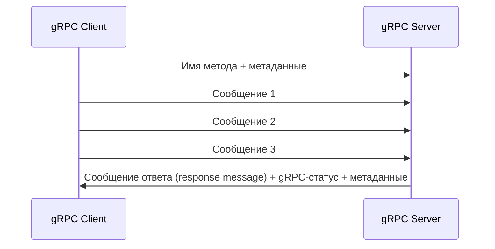

---
aliases:
 - клиентский поток
 - клиентского потока
 - клиентскому потоку
 - клиентским потоком
 - клиентском потоке
 - клиентские потоки
 - клиентских потоков
 - клиентским потокам
 - клиентскими потоками
 - клиентских потоках
share: true
tags:
 - gRPC/client-streaming
---
# Клиентский поток
Клиент инициирует удалённый вызов процедуры с помощью указания имени метода и метаданных. Затем клиент отправляет поток сообщений. Однако, сервер может отправить код статуса и метаданные до отправки всех клиентских сообщений.
## Диаграмма

## Protobuf
```protobuf
rpc ClientStreamingFunction (stream InputMessage) returns (OutputMessage) {}
```
## Реализация на сервере
```csharp
public override async Task<OutputMessage> ClientStreamingFunction(IAsyncStreamReader<InputMessage> requestStream, ServerCallContext context)
{
	// итерируемся по входящим сообщениям
	await foreach (var idRequest in requestStream.ReadAllAsync())
	{
		// реализация обработки входящих сообщений
	}
	return new OutputMessage {/*заполняем поля*/};
}
```
## Использование на клиенте
```csharp
// создаём объект запроса
using var clientStreamingCall = client.Delete();
// Итерируемся по IEnumerable<InputMessage>, или по IAsyncEnumerable<InputMessage>
foreach (var request in InputMessageEnumerable)
{
	// отправляем очередное сообщение на сервер
	await clientStreamingCall.RequestStream.WriteAsync(request);
}
// Сообщаем серверу о завершении передачи
await clientStreamingCall.RequestStream.CompleteAsync();
// Завершаем запрос получением ответа
OutputMessage result = await clientStreamingCall.ResponseAsync;
```
## Ссылки
[[ch-3-types-of-grpc-services|Диаграммы всех видов взаимодействия]]
[[ch-5-create-and-compile-protobuf-files|примеры Protobuf]]
[[ch-5-write-configure-and-expose-grpc-services|Примеры реализаций на сервере]]
[[ch-7-client-streaming-call|Пример клиента]]
