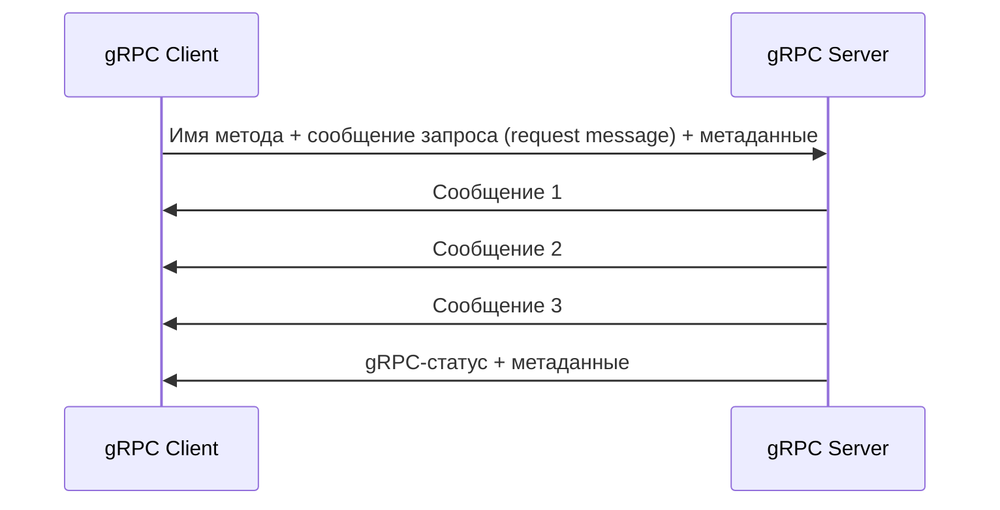

---
aliases:
 - серверный поток
 - серверного потока
 - серверному потоку
 - серверным потоком
 - серверном потоке
 - серверные потоки
 - серверных потоков
 - серверным потокам
 - серверными потоками
 - серверных потоках
share: true
tags:
 - grpc/server-streaming
---
# Серверный поток
Клиент инициирует удалённый вызов процедуры с помощью указания имени метода, метаданных и сообщения запроса. Затем он получает поток от сервера. Сервер возвращает gRPC-cтатус только после того, как все запрошенные данные переданы. Вот как это выглядит на диаграмме.
## Диаграмма

## Protobuf
```protobuf
rpc ServerStreamingFunction (InputMessage) returns (stream OutputMessage) {}
```
## Реализация на сервере
```csharp
public override async Task ServerStreamingFunction(InputMessage request, IServerStreamWriter<OutputMessage> responseStream, ServerCallContext context)
{
	// итерируемся по IEnumerable<OutputMessage> или IAsyncEnumerable<OutputMessage>
	foreach (var outputMessage in outputMessageEnumerable)
	{
		await responseStream.WriteAsync(outputMessage);
	}
}
```
## Использование на клиенте
```csharp
using var serverStreamingCall = client.ServerStreamingFunction(new InputMessage {/*заполняем поля*/});
//Итерируемся по IAsyncEnumerable до тех пор, пока сервер не закончит передачу
await foreach (OutputMessage response in serverStreamingCall.ResponseStream.ReadAllAsync())
{
	// обработка сообщения
}
```
## Ссылки
[[ch-3-types-of-grpc-services|Диаграммы всех видов взаимодействия]]
[[ch-5-create-and-compile-protobuf-files|примеры Protobuf]]
[[ch-5-write-configure-and-expose-grpc-services|Примеры реализаций на сервере]]
[[ch-7-server-streaming-call|Пример клиента]]