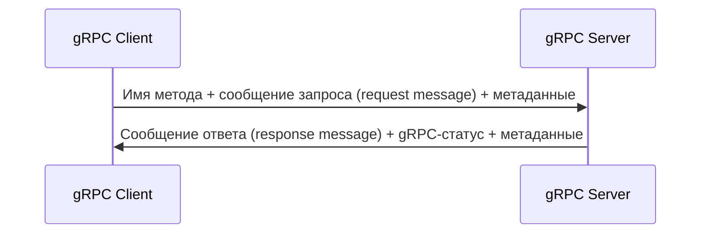
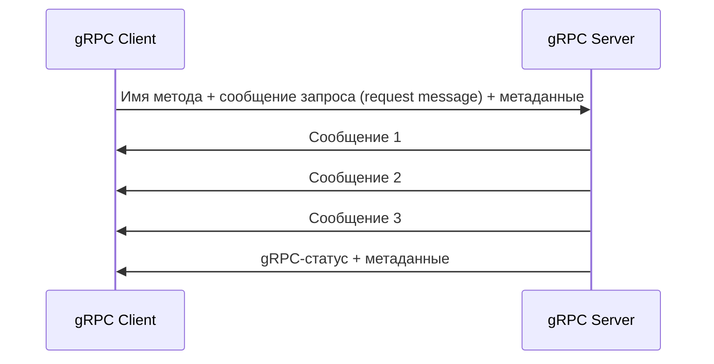
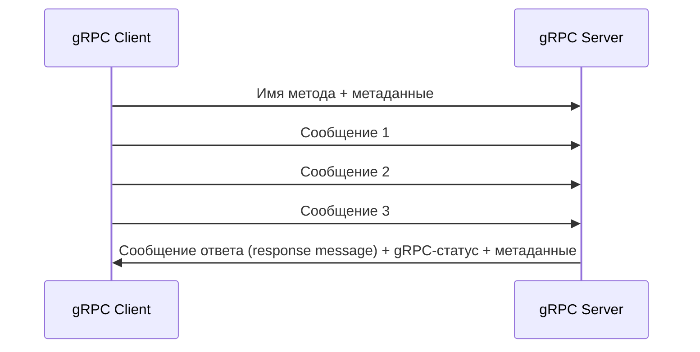
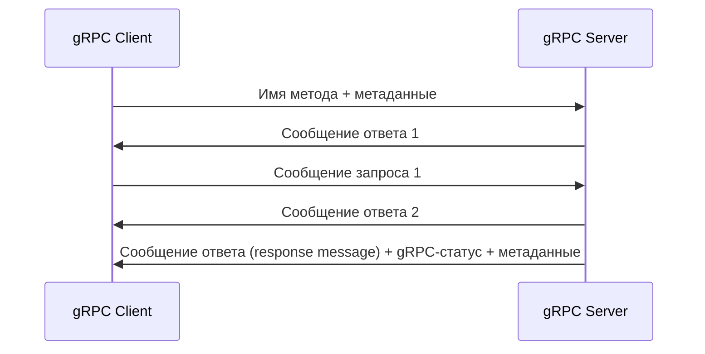

# Типы сервисов gRPC
gRPC поддерживает 4 типа вызовов к серверу:
- Унарный
- Поток от сервера
- Поток от клиента
- двухсторонний поток

В отличие от REST API который поддерживает только унарный тип вызовов (клиент отправляет запрос, сервер получает его и возвращает ответ), gRPC поддерживает все 4 типа[^1].
## Унарные вызовы
Клиент инициирует удалённый вызов процедуры с помощью указания имени метода, метаданных и сообщения запроса. Сервер возвращает ответ, содержащий gRPC-статус, сообщение ответа и метаданные. 

## Вызовы с потоком от сервера
Клиент инициирует удалённый вызов процедуры с помощью указания имени метода, метаданных и сообщения запроса. Затем он получает поток от сервера. Сервер возвращает gRPC-cтатус только после того, как все запрошенные данные переданы. Вот как это выглядит на диаграмме.

## Вызовы с потоком от клиента
Клиент инициирует удалённый вызов процедуры с помощью указания имени метода и метаданных. Затем клиент отправляет поток сообщений. Однако, сервер может отправить код статуса и метаданные до отправки всех клиентских сообщений. Диаграмма:

## Вызовы с двухсторонним потоковым обменом
Каждый из участников взаимодействия отправляет свои сообщения в потоковом режиме, это может происходить параллельно, что означает, что порядок, в котором отправляются сообщения от клиента и от сервера, отсутствует. Клиент инициирует удалённый вызов процедуры с помощью указания имени метода и метаданных. Затем сервер может немедленно ответить возвратом статуса и метаданных (или же может это сделать, когда клиент отправит все свои сообщения). Диаграмма:

[^1]: Также все 4 типа поддерживает SignalR, подробнее про стриминг в SignalR [[ch-6-streaming-in-signalr|здесь]].